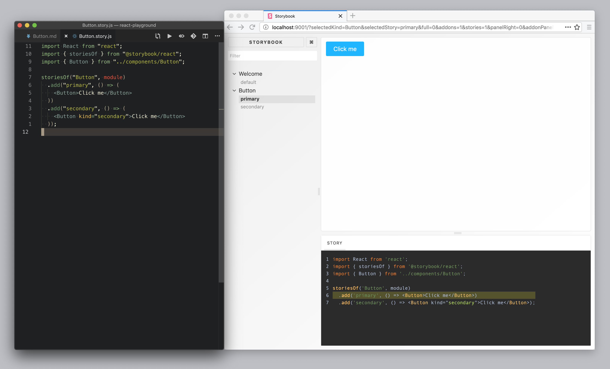

## react-playground

playground for react, redux, jest, gatsby, graphql, et al.

### demo-react-site

start development webserver.

~~~console
$ yarn react:start
~~~

- view site in the browser: http://localhost:3030/

### demo-gatsby-site

start development webserver.

~~~console
$ yarn gatsby:start
~~~

- view site in the browser: http://localhost:8000/
- explore site's data and schema: http://localhost:8000/___graphql

### demo-docz-site

start development webserver.

~~~console
$ yarn docz:start
~~~

- view site in the browser: http://localhost:3000/#/

### demo-storybook-site

start development webserver.

~~~console
$ yarn storybook:start
~~~

- view site in the browser: http://localhost:9001/

### demo-styleguidist-site

start development webserver.

~~~console
$ yarn styleguidist:start
~~~

- view site in the browser: http://localhost:6060/

